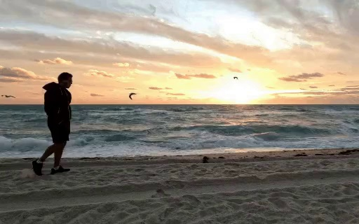
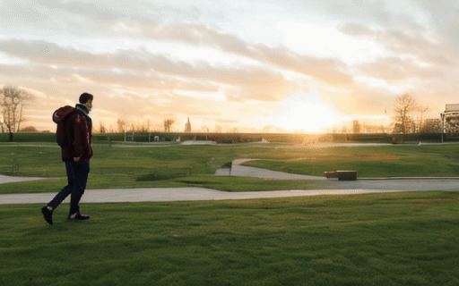

## Consistent and Controllable Image Animation with Motion Diffusion Models<br><sub>Official PyTorch Implementation</sub>


[](https://arxiv.org/abs/2407.15642) 
[](https://maxin-cn.github.io/cinemo_project/)
[](https://huggingface.co/spaces/maxin-cn/Cinemo)

> [**Consistent and Controllable Image Animation with Motion Diffusion Models**](https://maxin-cn.github.io/cinemo_project/)<br>
> [Xin Ma](https://maxin-cn.github.io/), [Yaohui Wang*†](https://wyhsirius.github.io/), [Gengyun Jia](https://scholar.google.com/citations?user=_04pkGgAAAAJ&hl=zh-CN), [Xinyuan Chen](https://scholar.google.com/citations?user=3fWSC8YAAAAJ), [Tien-Tsin Wong](https://ttwong12.github.io/myself.html), [Yuan-Fang Li](https://users.monash.edu/~yli/), [Cunjian Chen*](https://cunjian.github.io/) <br>
> (*Corresponding authors, †Project Lead)

This repo contains pre-trained weights, and sampling code of Cinemo. Please visit our [project page](https://maxin-cn.github.io/cinemo_project/) for more results.

<!--
In this project, we propose a novel method called Cinemo, which can perform motion-controllable image animation with strong consistency and smoothness. To improve motion smoothness, Cinemo learns the distribution of motion residuals, rather than directly generating subsequent frames. Additionally, a structural similarity index-based method is proposed to control the motion intensity. Furthermore, we propose a noise refinement technique based on discrete cosine transformation to ensure temporal consistency. These three methods help Cinemo generate highly consistent, smooth, and motion-controlled image animation results. Compared to previous methods, Cinemo offers simpler and more precise user control and better generative performance.
-->
 
<div align="center">
    
</div>

## News

- 🔥 **Feb. 27, 2025** 💥 Our paper is accepted by CVPR 2025.

- 🔥 **Jul. 29, 2024** 💥 [HuggingFace space](https://huggingface.co/spaces/maxin-cn/Cinemo) is added, you can also launch [gradio interface ](#gradio-interface) locally.

- 🔥 **Jul. 23, 2024** 💥 Our paper is released on [arxiv](https://arxiv.org/abs/2407.15642).

- 🔥 **Jun. 2, 2024** 💥 The inference code is released. The checkpoint can be found [here](https://huggingface.co/maxin-cn/Cinemo/tree/main).


## Setup

Download and set up the repo:

```bash
git clone https://github.com/maxin-cn/Cinemo
cd Cinemo
conda env create -f environment.yml
conda activate cinemo
```
<!--
We provide an [`environment.yml`](environment.yml) file that can be used to create a Conda environment. If you only want 
to run pre-trained models locally on CPU, you can remove the `cudatoolkit` and `pytorch-cuda` requirements from the file.
```bash
conda env create -f environment.yml
conda activate cinemo
```
-->


## Animation 

You can sample from our **pre-trained Cinemo models** with [`animation.py`](pipelines/animation.py). Weights for our pre-trained Cinemo model can be found [here](https://huggingface.co/maxin-cn/Cinemo/tree/main).  The script has various arguments for adjusting sampling steps, changing the classifier-free guidance scale, etc:

```bash
bash pipelines/animation.sh
```

Related model weights will be downloaded automatically, and the following results can be obtained,

<table style="width:100%; text-align:center;">
<tr>
  <td align="center">Input image</td>
  <td align="center">Output video</td>
  <td align="center">Input image</td>
  <td align="center">Output video</td>
</tr>
<tr>
  <td align="center"></td>
  <td align="center"></td>
  <td align="center"></td>
  <td align="center"></td>
</tr>
<tr>
  <td align="center" colspan="2">"People Walking"</td>
  <td align="center" colspan="2">"Sea Swell"</td>
</tr>
<tr>
  <td align="center"></td>
  <td align="center"></td>
  <td align="center"></td>
  <td align="center"></td>
</tr>
<tr>
  <td align="center" colspan="2">"Girl Dancing under the Stars"</td>
  <td align="center" colspan="2">"Dragon Glowing Eyes"</td>
</tr>
<tr>
  <td align="center"></td>
  <td align="center"></td>
  <td align="center"></td>
  <td align="center"></td>
</tr>
<tr>
  <td align="center" colspan="2">"Bubbles Floating upwards"</td>
  <td align="center" colspan="2">"Snowman Waving his Hand"</td>
</tr>

</table>

## Gradio interface
We also provide a local gradio interface, just run:
```bash
python app.py
```
You can specify the `--share` and `--server_name` arguments to meet your requirement!

## Other Applications

You can also utilize Cinemo for other applications, such as motion transfer and video editing:

```bash
bash pipelines/video_editing.sh
```

Related checkpoints will be downloaded automatically and following results will be obtained,

<table style="width:100%; text-align:center;">
<tr>
  <td align="center">Input video</td>
  <td align="center">First frame</td>
  <td align="center">Edited first frame</td>
  <td align="center">Output video</td>
</tr>
<tr>
  <td align="center"></td>
  <td align="center"></td>
  <td align="center"></td>
  <td align="center"></td>
</tr>

</table>

or motion transfer,
<table style="width:100%; text-align:center;">
<tr>
  <td align="center">Input video</td>
  <td align="center">First frame</td>
  <td align="center">Edited first frame</td>
  <td align="center">Output video</td>
</tr>
<tr>
  <td align="center"></td>
  <td align="center"></td>
  <td align="center"></td>
  <td align="center"></td>
</tr>

</table>

## Contact Us
Xin Ma: xin.ma1@monash.edu,
Yaohui Wang: wangyaohui@pjlab.org.cn 

## Citation
If you find this work useful for your research, please consider citing it.
```bibtex
@article{ma2024cinemo,
  title={Cinemo: Consistent and Controllable Image Animation with Motion Diffusion Models},
  author={Ma, Xin and Wang, Yaohui and Jia, Gengyun and Chen, Xinyuan and Wong, Tien-Tsin and Li, Yuan-Fang and Chen, Cunjian},
  journal={arXiv preprint arXiv:2407.15642},
  year={2024}
}
```


## Acknowledgments
Cinemo has been greatly inspired by the following amazing works and teams: [LaVie](https://github.com/Vchitect/LaVie) and [SEINE](https://github.com/Vchitect/SEINE), we thank all the contributors for open-sourcing.


## License
The code and model weights are licensed under [LICENSE](LICENSE).
