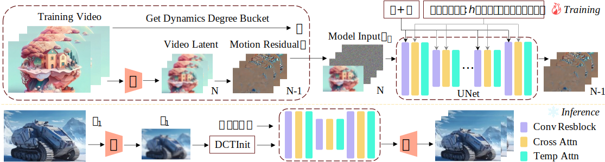

## Cinemo: Consistent and Controllable Image Animation with Motion Diffusion Models<br><sub>Official PyTorch Implementation</sub>


[](https://maxin-cn.github.io/cinemo_project/) 
[](https://maxin-cn.github.io/cinemo_project/)


This repo contains pre-trained weights, and sampling code for our paper exploring image animation with motion diffusion models (Cinemo). You can find more visualizations on our [project page](https://maxin-cn.github.io/cinemo_project/).

In this project, we propose a novel method called Cinemo, which can perform motion-controllable image animation with strong consistency and smoothness. To improve motion smoothness, Cinemo learns the distribution of motion residuals, rather than directly generating subsequent frames. Additionally, a structural similarity index-based method is proposed to control the motion intensity. Furthermore, we propose a noise refinement technique based on discrete cosine transformation to ensure temporal consistency. These three methods help Cinemo generate highly consistent, smooth, and motion-controlled image animation results. Compared to previous methods, Cinemo offers simpler and more precise user control and better generative performance.
 
<div align="center">
    
</div>

## News
- (🔥 New) Jun. 2, 2024. 💥 The inference code is released. The checkpoint can be found [here](https://huggingface.co/maxin-cn/Cinemo/tree/main).


## Setup

First, download and set up the repo:

```bash
git clone https://github.com/maxin-cn/Cinemo
cd Cinemo
```

We provide an [`environment.yml`](environment.yml) file that can be used to create a Conda environment. If you only want 
to run pre-trained models locally on CPU, you can remove the `cudatoolkit` and `pytorch-cuda` requirements from the file.

```bash
conda env create -f environment.yml
conda activate cinemo
```


## Animation 

You can sample from our **pre-trained Cinemo models** with [`animation.py`](pipelines/animation.py). Weights for our pre-trained Cinemo model can be found [here](https://huggingface.co/maxin-cn/Cinemo/tree/main).  The script has various arguments for adjusting sampling steps, changing the classifier-free guidance scale, etc:

```bash
bash pipelines/animation.sh
```

All related checkpoints will download automatically and then you will get the following results,

<table style="width:100%; text-align:center;">
<tr>
  <td align="center">Input image</td>
  <td align="center">Output video</td>
  <td align="center">Input image</td>
  <td align="center">Output video</td>
</tr>
<tr>
  <td align="center"></td>
  <td align="center"></td>
  <td align="center"></td>
  <td align="center"></td>
</tr>
<tr>
  <td align="center" colspan="2">"People Walking"</td>
  <td align="center" colspan="2">"Sea Swell"</td>
</tr>
<tr>
  <td align="center"></td>
  <td align="center"></td>
  <td align="center"></td>
  <td align="center"></td>
</tr>
<tr>
  <td align="center" colspan="2">"Girl Dancing under the Stars"</td>
  <td align="center" colspan="2">"Dragon Glowing Eyes"</td>
</tr>

</table>


## Other Applications

You can also utilize Cinemo for other applications, such as motion transfer and video editing:

```bash
bash pipelines/video_editing.sh
```

All related checkpoints will download automatically and you will get the following results,

<table style="width:100%; text-align:center;">
<tr>
  <td align="center">Input video</td>
  <td align="center">First frame</td>
  <td align="center">Edited first frame</td>
  <td align="center">Output video</td>
</tr>
<tr>
  <td align="center"></td>
  <td align="center"></td>
  <td align="center"></td>
  <td align="center"></td>
</tr>

</table>


<!-- ## Citation
If you find this work useful for your research, please consider citing it.
```bibtex
@article{ma2024Cinemo,
  title={Cinemo: Latent Diffusion Transformer for Video Generation},
  author={Ma, Xin and Wang, Yaohui and Jia, Gengyun and Chen, Xinyuan and Liu, Ziwei and Li, Yuan-Fang and Chen, Cunjian and Qiao, Yu},
  journal={arXiv preprint arXiv:2401.03048},
  year={2024}
}
``` -->


## Acknowledgments
Cinemo has been greatly inspired by the following amazing works and teams: [LaVie](https://github.com/Vchitect/LaVie) and [SEINE](https://github.com/Vchitect/SEINE), we thank all the contributors for open-sourcing.


## License
The code and model weights are licensed under [LICENSE](LICENSE).
